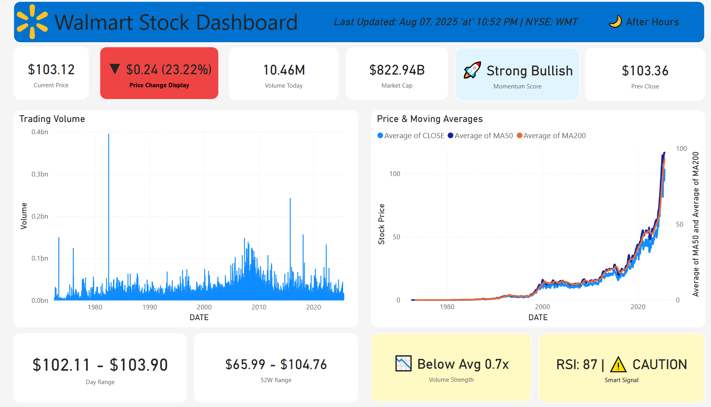
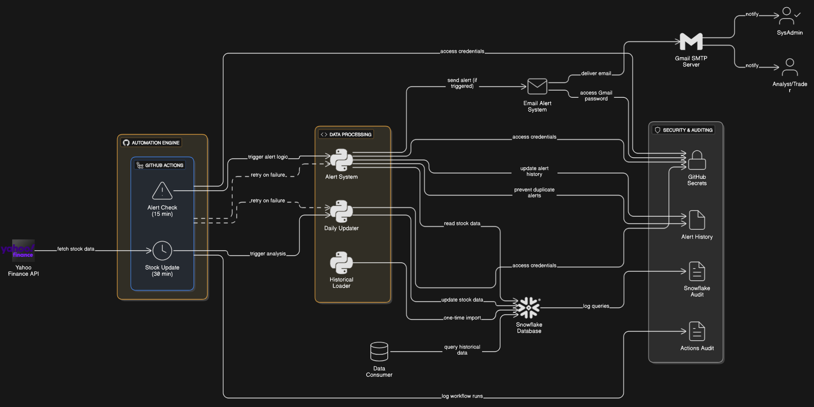
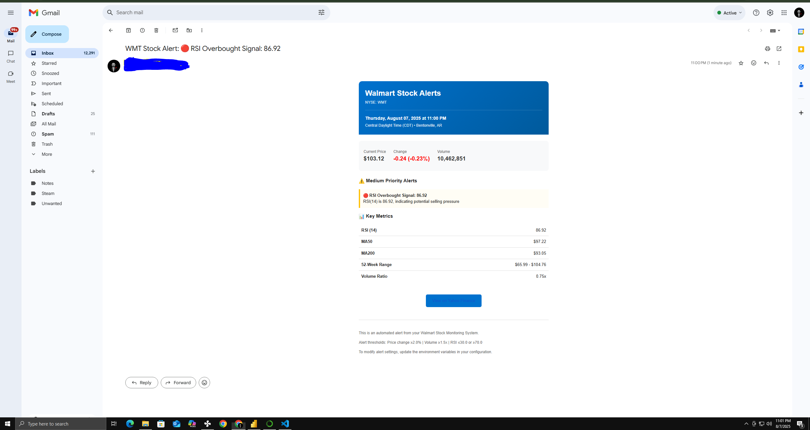
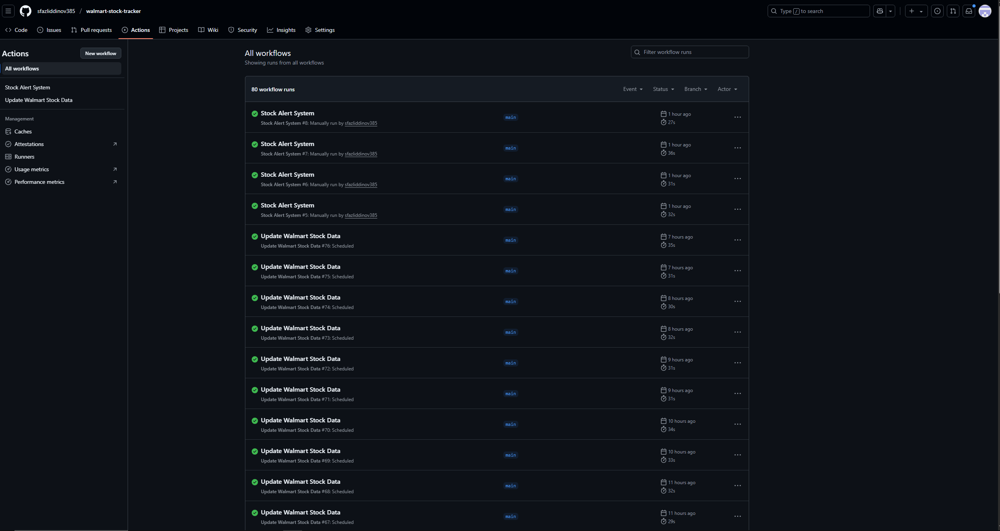
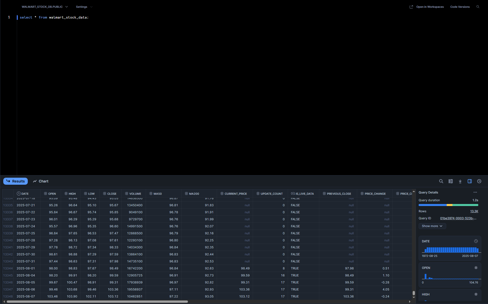

# Walmart Stock Tracker

A real-time automated system I built to monitor Walmart stock prices and send email alerts when important market events occur.



## Technologies Used

### Languages


### Frameworks & Libraries


### Database & Cloud


### Communication


### Tools


## Overview

I created this project to automatically track Walmart (WMT) stock without having to manually check prices throughout the day. The system runs entirely in the cloud using GitHub Actions and sends me email notifications when significant changes happen in the stock price or trading patterns.

## Features

- **Automated Data Collection**: Fetches stock data every 30 minutes during market hours
- **Smart Alerts**: Sends email notifications for important events like price changes, volume spikes, and technical indicators
- **Historical Tracking**: Stores over 50 years of stock data in Snowflake database
- **No Manual Work**: Runs completely automated 24/7 without any intervention

## System Architecture



The system consists of five main components working together:

1. **Yahoo Finance API** - Provides real-time stock data
2. **GitHub Actions** - Automates the entire workflow
3. **Python Scripts** - Processes data and checks alert conditions
4. **Snowflake Database** - Stores all historical data
5. **Email Alert System** - Sends formatted notifications via Gmail

## How It Works

### Data Collection
Every 30 minutes during market hours (9:30 AM - 4:00 PM ET), my system:
- Connects to Yahoo Finance API
- Downloads current stock prices and volume
- Calculates technical indicators (RSI, Moving Averages)
- Stores everything in Snowflake database

### Alert Monitoring
Every 15 minutes, the alert system checks for:
- Price movements greater than 2%
- Trading volume 50% above average
- RSI indicating oversold (below 30) or overbought (above 70)
- Stock approaching 52-week highs or lows
- Moving average crossovers

When any condition triggers, I receive an email like this:



## Automated Workflows

The system uses two GitHub Actions workflows that run on schedule:



- **update_stock.yml** - Updates stock data every 30 minutes
- **alert_system.yml** - Checks for alert conditions every 15 minutes

## Database

All historical data is stored in Snowflake with the following information:



- Daily prices (Open, High, Low, Close)
- Trading volume
- Technical indicators (RSI, MA50, MA200)
- 52-week high/low
- Market cap information

## Installation

### Prerequisites
- Python 3.10 or higher
- Snowflake account
- Gmail account with app-specific password
- GitHub account

### Setup Steps

1. **Clone the repository**
  ```bash
  git clone https://github.com/sfazliddin/walmart-stock-tracker.git
  cd walmart-stock-tracker
  ```

2. **Install dependencies**
  ```bash
  pip install -r requirements.txt
  ```

3. **Set up GitHub Secrets**
  
  Go to Settings > Secrets and add:
  - `SNOWFLAKE_USER` - Your Snowflake username
  - `SNOWFLAKE_PASSWORD` - Your Snowflake password
  - `SNOWFLAKE_ACCOUNT` - Your Snowflake account identifier
  - `SNOWFLAKE_WAREHOUSE` - Your warehouse name (default: COMPUTE_WH)
  - `SNOWFLAKE_DATABASE` - Your database name (default: WALMART_STOCK_DB)
  - `SNOWFLAKE_SCHEMA` - Your schema name (default: PUBLIC)
  - `SENDER_EMAIL` - Gmail address for sending alerts
  - `SENDER_PASSWORD` - Gmail app-specific password
  - `RECIPIENT_EMAILS` - Email addresses to receive alerts (comma-separated)

4. **Initialize the database**
  ```bash
  python scripts/initial_historical_load.py
  ```

5. **Enable GitHub Actions**
  - Go to Actions tab in your repository
  - Enable workflows if prompted

## Project Structure

```
walmart-stock-tracker/
├── .github/
│   └── workflows/
│       ├── update_stock.yml        # 30-minute stock update workflow
│       └── alert_system.yml        # 15-minute alert check workflow
├── scripts/
│   ├── update_current_day.py       # Updates current stock data
│   ├── alert_system.py             # Checks and sends alerts
│   └── initial_historical_load.py  # One-time historical data import
├── images/
│   ├── Dashboard.PNG
│   ├── Email.PNG
│   ├── Github_Actions.PNG
│   ├── Snowflake.PNG
│   └── System_Architecture_Design.PNG
├── requirements.txt                # Python dependencies
└── README.md                       # This file
```

## Alert Types

The system monitors for these conditions:

| Alert Type | Trigger Condition | Priority |
|------------|------------------|----------|
| Price Movement | Change > 2% | High |
| Volume Spike | Volume > 1.5x average | Medium |
| RSI Oversold | RSI < 30 | High |
| RSI Overbought | RSI > 70 | Medium |
| 52-Week High | Within 1% of yearly high | High |
| 52-Week Low | Within 5% of yearly low | High |
| Golden Cross | MA50 crosses above MA200 | High |
| Death Cross | MA50 crosses below MA200 | High |

## Configuration

### Adjusting Alert Thresholds

You can modify alert thresholds by updating GitHub Secrets:
- `PRICE_CHANGE_THRESHOLD` - Default: 2.0 (percent)
- `VOLUME_SPIKE_THRESHOLD` - Default: 1.5 (times average)
- `RSI_OVERSOLD` - Default: 30
- `RSI_OVERBOUGHT` - Default: 70

### Changing Schedule

Edit the cron expressions in workflow files:
- `.github/workflows/update_stock.yml` - Stock update frequency
- `.github/workflows/alert_system.yml` - Alert check frequency

## Monitoring

The system provides several ways to monitor its operation:

1. **GitHub Actions Dashboard** - View workflow runs and logs
2. **Email Notifications** - Receive alerts for important events
3. **Snowflake Queries** - Query historical data directly
4. **Alert History** - JSON file tracking sent alerts

## Troubleshooting

### Common Issues

**No emails received:**
- Check Gmail app-specific password is correct
- Verify recipient email addresses in secrets
- Check spam folder

**Workflows not running:**
- Ensure GitHub Actions is enabled
- Check workflow syntax in YAML files
- Verify all secrets are set

**Database connection errors:**
- Verify Snowflake credentials
- Check warehouse is running
- Ensure database and schema exist

## Performance

- **Update Frequency**: 48 times per day during market hours
- **Alert Checks**: 96 times per day during market hours
- **Data Points Stored**: Over 13,000 historical records
- **Average Response Time**: Less than 1 minute from event to notification
- **Storage Used**: Minimal (under 10 MB in Snowflake)

## Sample Code

### Update Current Day Script
```python
# update_current_day.py
import yfinance as yf
import snowflake.connector
import pandas as pd
from datetime import datetime

def get_yahoo_finance_data():
   """Fetch current Walmart data from Yahoo Finance"""
   wmt = yf.Ticker("WMT")
   hist = wmt.history(period="1d")
   # Process and return data
   return data

def update_snowflake(data):
   """Update Snowflake with latest data"""
   conn = snowflake.connector.connect(
       user=os.environ['SNOWFLAKE_USER'],
       password=os.environ['SNOWFLAKE_PASSWORD'],
       account=os.environ['SNOWFLAKE_ACCOUNT']
   )
   # Update database
   conn.close()
```

### Alert System Script
```python
# alert_system.py
import smtplib
from email.mime.text import MIMEText
from email.mime.multipart import MIMEMultipart

class StockAlertSystem:
   def __init__(self):
       self.smtp_server = 'smtp.gmail.com'
       self.smtp_port = 587
       self.sender_email = os.environ.get('SENDER_EMAIL')
       
   def check_alerts(self, data):
       """Check for various alert conditions"""
       alerts = []
       if abs(data['price_change_pct']) >= 2.0:
           alerts.append({
               'type': 'PRICE_MOVEMENT',
               'severity': 'HIGH',
               'message': f'Price moved {data["price_change_pct"]:.2f}%'
           })
       return alerts
       
   def send_email(self, alerts, data):
       """Send email with alerts"""
       msg = MIMEMultipart('alternative')
       msg['Subject'] = f"WMT Stock Alert"
       msg['From'] = self.sender_email
       # Send email
       server.send_message(msg)
```

### GitHub Actions Workflow
```yaml
# .github/workflows/update_stock.yml
name: Update Walmart Stock Data
on:
 schedule:
   - cron: '*/30 13-21 * * 1-5'  # Every 30 min during market hours
 workflow_dispatch:

jobs:
 update-stock-data:
   runs-on: ubuntu-latest
   steps:
   - uses: actions/checkout@v4
   - uses: actions/setup-python@v5
     with:
       python-version: '3.10'
   - run: |
       pip install -r requirements.txt
       python scripts/update_current_day.py
```

### Requirements File
```txt
# requirements.txt
yfinance==0.2.28
pandas==2.0.3
snowflake-connector-python==3.0.4
pytz==2023.3
numpy==1.24.3
python-dotenv==1.0.0
```

## Future Improvements

I plan to add these features:
- Support for multiple stocks
- Web dashboard for real-time viewing
- SMS notifications
- More technical indicators
- Trading strategy backtesting
- Weekly/monthly summary reports

## License

This project is open source and available under the MIT License.

## Contact

Created by sfazliddin - Feel free to contact me with questions or suggestions.

---

**Note**: This project is for educational purposes. Always do your own research before making investment decisions.
