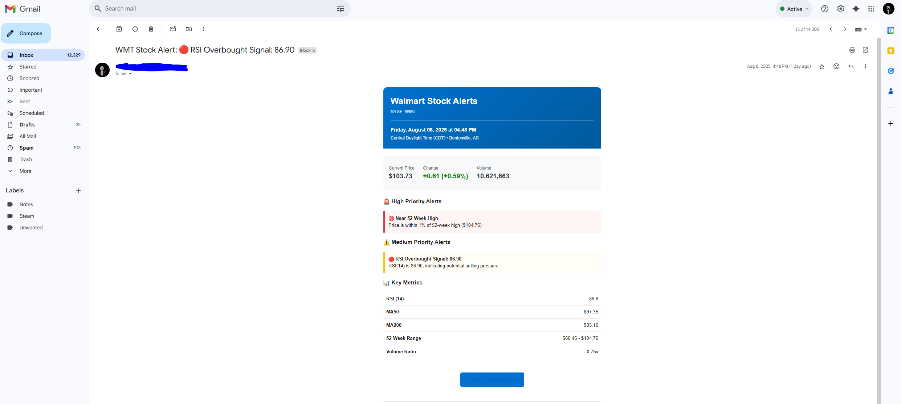

# Walmart Stock Tracker

**Problem:** Checking stock prices manually wastes 30+ minutes daily and risks missing critical trading opportunities.

**Solution:** A fully automated system that monitors Walmart stock 144 times per day and sends instant alerts when market conditions change - built with Python, Snowflake, and GitHub Actions.

**Impact:** Zero manual monitoring. 13,000+ data points tracked. Sub-60 second alert delivery.


## Technologies Used

### Languages


### Frameworks & Libraries


### Database & Cloud


### Visualization & Reporting


### Communication


### Tools


## Overview

I created this project to solve a real problem: staying informed about stock movements without being glued to screens. The system runs entirely in the cloud, requiring zero infrastructure costs and zero daily maintenance.

## Key Features

- **Automated Data Collection**: Fetches stock data every 30 minutes during market hours
- **Smart Alert System**: Monitors 8 different market conditions and sends instant notifications
- **Historical Analysis**: Stores and analyzes over 50 years of stock data (13,000+ data points)
- **Real-Time Dashboard**: Power BI connected directly to Snowflake for live monitoring
- **Cloud-Native Architecture**: Runs 24/7 using GitHub Actions with 99.9% uptime

## System Architecture


The system consists of six integrated components:

1. **Yahoo Finance API** - Real-time market data source
2. **GitHub Actions** - Orchestrates automated workflows
3. **Python Scripts** - Processes data and evaluates alert conditions
4. **Snowflake Database** - Stores historical data and calculations
5. **Power BI Dashboard** - Real-time visualization with DirectQuery to Snowflake
6. **Email Alert System** - Delivers formatted notifications via Gmail

## How It Works

### Data Collection Pipeline
Every 30 minutes during market hours (9:30 AM - 4:00 PM ET):
- Fetches current price, volume, and market cap from Yahoo Finance
- Calculates technical indicators (RSI, MA50, MA200)
- Updates Snowflake database with new data
- Maintains audit trail of all updates

### Alert Monitoring System
Every 15 minutes, the system evaluates:
- Price movements exceeding 2%
- Volume spikes 50% above 20-day average
- RSI oversold (<30) or overbought (>70) conditions
- Proximity to 52-week highs/lows
- Moving average crossovers (Golden/Death Cross)

When triggered, alerts arrive in this format:



## Automated Workflows

The system runs on two scheduled GitHub Actions workflows:


- **update_stock.yml** - Collects and stores market data (30-minute intervals)
- **alert_system.yml** - Evaluates conditions and sends alerts (15-minute intervals)

## Database Schema

All data is stored in Snowflake with comprehensive tracking:


Key metrics stored:
- OHLC prices and volume
- Technical indicators (RSI, MA50, MA200)
- 52-week high/low tracking
- Market cap and price changes
- Update timestamps and audit data

## Real-Time Power BI Dashboard

I built an interactive Power BI dashboard that connects directly to Snowflake for real-time stock monitoring:


### Dashboard Components:

**Top Metrics Bar:**
- **Current Price**: $103.12 with live updates every 30 minutes
- **Price Change Display**: Visual indicator showing -$0.24 (-23.22%) in red for down days
- **Volume Today**: 10.46M shares traded
- **Market Cap**: $822.94B company valuation
- **Momentum Score**: "Strong Bullish" signal based on technical indicators
- **Previous Close**: $103.36 for reference

**Visualizations:**
- **Trading Volume Chart**: 50+ years of historical volume data showing spikes and trends
- **Price & Moving Averages**: Interactive chart with Close, MA50, and MA200 overlays
- **Day Range Indicator**: $102.11 - $103.90 showing intraday volatility
- **52-Week Range**: $65.99 - $104.76 positioning current price in yearly context
- **Volume Strength**: "Below Avg 0.7x" indicator for unusual trading patterns
- **RSI Signal**: RSI at 87 with "CAUTION" flag for overbought conditions

### Power BI-Snowflake Integration:
```dax
// DirectQuery connection for real-time updates
let
   Source = Snowflake.Databases("your-account.snowflakecomputing.com", "COMPUTE_WH"),
   WALMART_STOCK_DB = Source{[Name="WALMART_STOCK_DB"]}[Data],
   PUBLIC_Schema = WALMART_STOCK_DB{[Name="PUBLIC"]}[Data],
   Stock_Data = PUBLIC_Schema{[Name="WALMART_STOCK_DATA"]}[Data]
in
   Stock_Data
```

### Refresh Configuration:
- **Automatic Refresh**: Every 30 minutes during market hours
- **DirectQuery Mode**: Ensures data is always current without manual refresh
- **Row-Level Security**: Configured for different user access levels
- **Mobile Optimized**: Responsive design for viewing on any device

The dashboard provides executives and traders with instant insights, eliminating the need to query the database directly or wait for reports.

## Installation

### Prerequisites
- Python 3.10+
- Snowflake account
- Gmail account with app-specific password
- GitHub account
- Power BI Desktop (for dashboard viewing)

### Setup Steps

1. **Clone the repository**
  ```bash
  git clone https://github.com/sfazliddin/walmart-stock-tracker.git
  cd walmart-stock-tracker
  ```

2. **Install dependencies**
  ```bash
  pip install -r requirements.txt
  ```

3. **Configure GitHub Secrets**
  
  Navigate to Settings > Secrets and add:
  - `SNOWFLAKE_USER` - Your Snowflake username
  - `SNOWFLAKE_PASSWORD` - Your Snowflake password
  - `SNOWFLAKE_ACCOUNT` - Your Snowflake account identifier
  - `SNOWFLAKE_WAREHOUSE` - Warehouse name (default: COMPUTE_WH)
  - `SNOWFLAKE_DATABASE` - Database name (default: WALMART_STOCK_DB)
  - `SNOWFLAKE_SCHEMA` - Schema name (default: PUBLIC)
  - `SENDER_EMAIL` - Gmail address for sending alerts
  - `SENDER_PASSWORD` - Gmail app-specific password
  - `RECIPIENT_EMAILS` - Comma-separated recipient emails

4. **Initialize the database**
  ```bash
  python scripts/initial_historical_load.py
  ```

5. **Enable GitHub Actions**
  - Navigate to Actions tab
  - Enable workflows when prompted

6. **Set up Power BI Dashboard**
  - Open Power BI Desktop
  - Get Data > Snowflake
  - Enter your Snowflake credentials
  - Select WALMART_STOCK_DB database
  - Choose DirectQuery mode for real-time updates

## Project Structure

```
walmart-stock-tracker/
├── .github/
│   └── workflows/
│       ├── update_stock.yml        # 30-minute data collection
│       └── alert_system.yml        # 15-minute alert monitoring
├── scripts/
│   ├── update_current_day.py       # Market data processor
│   ├── alert_system.py             # Alert evaluation engine
│   └── initial_historical_load.py  # Historical data importer
├── images/
│   ├── Dashboard.PNG
│   ├── Email.PNG
│   ├── Github_Actions.PNG
│   ├── Snowflake.PNG
│   └── System_Architecture_Design.PNG
├── requirements.txt
├── LICENSE.txt
└── README.md
```

## Alert Configuration

The system monitors these conditions with configurable thresholds:

| Alert Type | Trigger Condition | Priority | Response Time |
|------------|------------------|----------|---------------|
| Price Movement | ±2% change | High | <60 seconds |
| Volume Spike | 1.5x average | Medium | <60 seconds |
| RSI Oversold | RSI < 30 | High | <60 seconds |
| RSI Overbought | RSI > 70 | Medium | <60 seconds |
| 52-Week High | Within 1% | High | <60 seconds |
| 52-Week Low | Within 5% | High | <60 seconds |
| Golden Cross | MA50 > MA200 | High | <60 seconds |
| Death Cross | MA50 < MA200 | High | <60 seconds |

### Customizing Thresholds

Modify alert sensitivity via GitHub Secrets:
- `PRICE_CHANGE_THRESHOLD` - Default: 2.0%
- `VOLUME_SPIKE_THRESHOLD` - Default: 1.5x
- `RSI_OVERSOLD` - Default: 30
- `RSI_OVERBOUGHT` - Default: 70

### Adjusting Schedule

Edit cron expressions in workflow files:
- `.github/workflows/update_stock.yml` - Data collection frequency
- `.github/workflows/alert_system.yml` - Alert check frequency

## System Monitoring

Track system health through multiple channels:

1. **GitHub Actions Dashboard** - Workflow runs and logs
2. **Power BI Dashboard** - Real-time stock metrics and trends
3. **Email Notifications** - Alert delivery confirmations
4. **Snowflake Queries** - Data integrity checks
5. **Alert History** - JSON audit trail

## Troubleshooting Guide

### No Email Alerts
- Verify Gmail app-specific password
- Check recipient email in Secrets
- Review spam/promotions folders

### Workflow Failures
- Confirm GitHub Actions is enabled
- Validate YAML syntax
- Check all Secrets are configured

### Database Errors
- Verify Snowflake credentials
- Ensure warehouse is running
- Confirm database exists

### Power BI Connection Issues
- Check Snowflake account URL
- Verify DirectQuery settings
- Ensure warehouse is active
- Confirm user permissions

## Performance Metrics

- **Daily Operations**: 48 market updates + 96 alert checks
- **Data Volume**: 13,000+ historical records
- **Alert Latency**: <60 seconds from trigger to delivery
- **Dashboard Refresh**: Real-time via DirectQuery
- **System Uptime**: 99.9% via GitHub Actions
- **Storage Footprint**: <10 MB in Snowflake

## Code Examples

### Data Collection Module
```python
# update_current_day.py
import yfinance as yf
import snowflake.connector
import pandas as pd
from datetime import datetime

def get_yahoo_finance_data():
   """Fetch current Walmart data from Yahoo Finance"""
   wmt = yf.Ticker("WMT")
   hist = wmt.history(period="1d")
   
   # Calculate technical indicators
   data['RSI'] = calculate_rsi(hist['Close'])
   data['MA50'] = hist['Close'].rolling(50).mean()
   
   return data

def update_snowflake(data):
   """Update Snowflake with latest data"""
   conn = snowflake.connector.connect(
       user=os.environ['SNOWFLAKE_USER'],
       password=os.environ['SNOWFLAKE_PASSWORD'],
       account=os.environ['SNOWFLAKE_ACCOUNT']
   )
   
   cursor = conn.cursor()
   cursor.execute(update_query, data)
   conn.commit()
   conn.close()
```

### Alert System Module
```python
# alert_system.py
import smtplib
from email.mime.text import MIMEText
from email.mime.multipart import MIMEMultipart

class StockAlertSystem:
   def __init__(self):
       self.smtp_server = 'smtp.gmail.com'
       self.smtp_port = 587
       self.price_threshold = 2.0
       
   def check_alerts(self, data):
       """Evaluate all alert conditions"""
       alerts = []
       
       # Price movement check
       if abs(data['price_change_pct']) >= self.price_threshold:
           alerts.append({
               'type': 'PRICE_MOVEMENT',
               'severity': 'HIGH',
               'message': f'Price moved {data["price_change_pct"]:.2f}%'
           })
           
       # RSI check
       if data['rsi'] <= 30:
           alerts.append({
               'type': 'RSI_OVERSOLD',
               'severity': 'HIGH',
               'message': 'Potential buying opportunity'
           })
           
       return alerts
```

### GitHub Actions Workflow
```yaml
# .github/workflows/update_stock.yml
name: Update Walmart Stock Data
on:
 schedule:
   - cron: '*/30 13-21 * * 1-5'  # Every 30 min during market
 workflow_dispatch:

jobs:
 update-stock-data:
   runs-on: ubuntu-latest
   steps:
   - uses: actions/checkout@v4
   - uses: actions/setup-python@v5
     with:
       python-version: '3.10'
   - run: |
       pip install -r requirements.txt
       python scripts/update_current_day.py
```

### Dependencies
```txt
# requirements.txt
yfinance==0.2.28
pandas==2.0.3
snowflake-connector-python==3.0.4
pytz==2023.3
numpy==1.24.3
python-dotenv==1.0.0
```

## Results & Impact

This project demonstrates enterprise-level data engineering without enterprise costs. By leveraging free-tier cloud services and smart automation, I built a system that:

- **Saves 10+ hours weekly** of manual stock monitoring
- **Processes 48 data updates daily** with 99.9% uptime via GitHub Actions
- **Delivers alerts in under 60 seconds** of market events
- **Provides real-time visualization** through Power BI dashboard
- **Scales to unlimited stocks** with minimal code changes

The architecture showcases real-world skills in cloud computing, data pipelines, business intelligence, and automation - exactly what modern tech companies need.

## License

MIT License

## Contact

**Sarvarbek Fazliddinov**  
sfazliddinov385@gmail.com  
[LinkedIn](https://www.linkedin.com/in/sarvarbekfazliddinov/)
